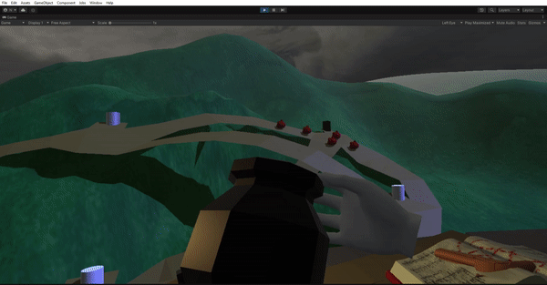
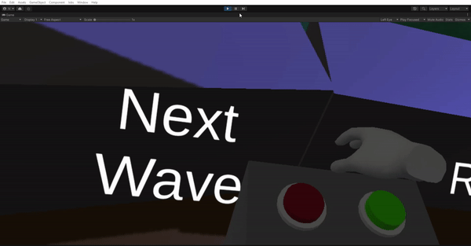
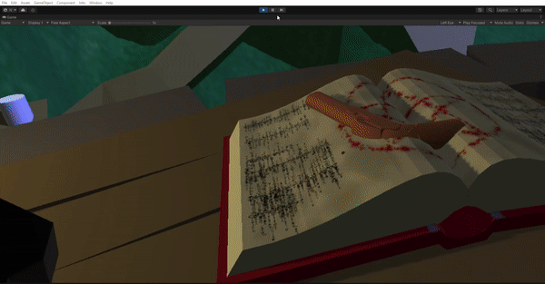

# VR Game prototype

### Authors

This is a project for the subject Interfaces Inteligentes in Universidad de La Laguna made by: 

* Dario Cerviño Luridiana (alu0101315058@ull.edu.es)
* Enrique Viña Alonso (alu0101337760@ull.edu.es)
* Juan Salvador Magariños Alba (alu0101352145@ull.edu.es)

The project is rushed because we were working on a tight time frame.

## Game description

**Game Overview:**
- The main loop of the game consists of defeating waves of increasing number of enemies.
- The player initiates each wave by pressing a button when they are ready.
- Enemies spawn from special points called "spawners" and aim to destroy certain objects near the player's tower.

**Player Abilities:**
- The player has a pistol to shoot enemies.
- The player can also craft 4 different kinds of potions in between waves that can be shot with a hand cannon.

**Player's Workspace (Tower):**
- The tower provides a view of the entire game map.
- Features:
  - Potion table with inventory access.
  - Main table with a pistol and a potion-firing cannon.
  - Game control panel for wave management.
  - Movement control panel for changing movement types.
  - An exit button.

**Resource Management:**
- Materials for potions are obtained by defeating enemies.
- Each potion creation consumes 4 ingredients.
- The player can control the wave start so the crafting can be made in between waves.

**Weapon Summoning:**
- Two books on the main table summon gunpowder weapons:
  - Right book: Summons up to two pistols.
  - Left book: Summons a potion-firing cannon.

**Enemy Behavior:**
- Enemies emerge from black cylinders and target white cylinders.
- If an enemy destroys a white cylinder, it changes color and becomes another potential entry point.
- The player loses if all white cylinders are destroyed.

**Player Movement Options:**
- The game offers two movement modes to cater to player preferences:
  - **Player-Action-Based Movement:** In this mode, players use a controller for movement, with a constant speed to prevent motion sickness.
  - **Teleportation-Based Movement:** This mode allows players to teleport to different positions within the game world, eliminating gradual movement changes while standing still to reduce motion sickness.

**Movement and Rotation:**
- Regardless of the chosen mode, real-world movements translate into virtual world movement.
- Players have the option to rotate in increments of 45º or -45º using "snap-based" rotations, preventing continuous spinning and reducing the risk of motion sickness.

**Game Controls:**
- The game utilizes only two input actions:
  - **Grip Button:** This button allows players to pick up objects and throw them.
  - **Trigger Button:** Players can use the trigger button to shoot.

**Notable Design Decisions for Virtual Reality:**
- The game's environment is designed to minimize the need for sudden and urgent head-turning, ensuring players can comfortably view the entire game terrain.

- Despite the bigger terrain where the enemies are located, the game offers a limited player area, which can be navigated using various comfortable VR movement systems.

- Haptic feedback is integrated into actions like shooting, enhancing the overall sense of immersion for players.
